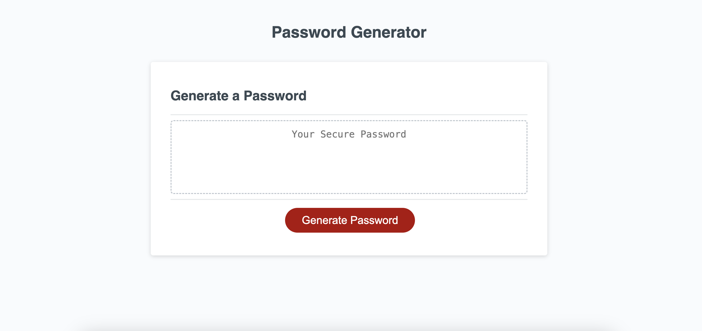

# password-generator

https://cassidykovell.github.io/password-generator/

## Description

This website acts as a random password generate based on certain criteria that the use selects

## Installation
No notes for installation.

## Usage
To use this website clock the "Generate Password" button and then when prompted select a passord between 8 and 128 characters. If you do not select between that number you will be alerted you must do so and will be prompted to try again. After selecting the number of letters you wish to have in your password you will be prompted with four kinds of criteria you wish to have in your password; lowercase, uppercase, numbers, and special characters. You must choose one of these criteria otherwsie you will be prompted to choose one in order to recieve a password. Once you have choosen at least one criteria you will receive a password in the password box. 

## Credits
I recieved help from the Xpert Learning assistant and my instructer Sandrine Poissonnet.

## License

## Badges

## Features
The feature of this website is so generate a random password based on user chosen criteria.

## How to Contribute

## Tests